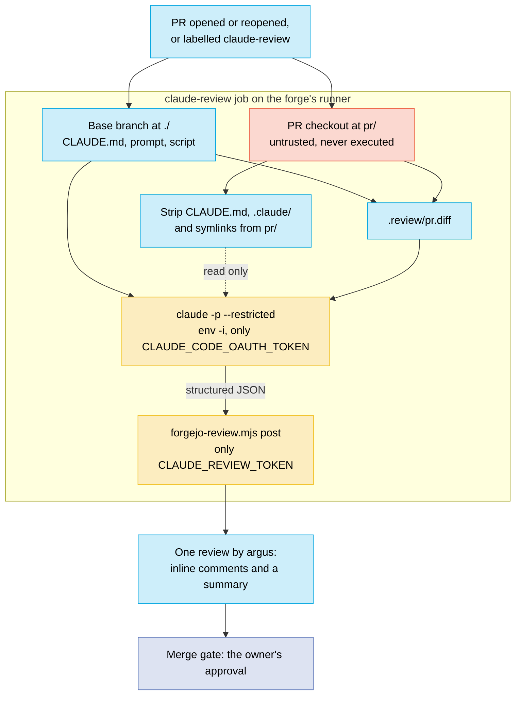

# Claude PR review

Every pull request on this repo gets a first-pass review from Claude, posted by
the forge's `argus` account. It is advisory: the merge still waits for the
owner's approval, which `.forgejo/CODEOWNERS` requests on every path.

This is the same pipeline the private infrastructure repo runs. That repo's
`docs/forge-ci.md` is the reference for the forge, the runner, the reviewer
account and the local rehearsal script (which works unchanged from a checkout of
this repo). This page covers what is specific to dotfiles.

| What | Where |
|---|---|
| Review when a PR opens or reopens, or on the `claude-review` label | `.forgejo/workflows/claude-review.yml` |
| The criteria the reviewer applies | `CLAUDE.md`, "Code review criteria" |
| Prompt, output schema, posting | `.forgejo/review/prompt.md`, `scripts/forgejo-review.mjs` |
| Pinned toolchain: bun, Claude Code | `.forgejo/ci/install-tools.sh` |
| Tests on every push to `main` and every PR | `.forgejo/workflows/test.yml` runs `bun test tests/` |
| Rules that hold the properties below in place | `tests/invariants/`, `tests/scripts/forgejo-review.test.js` |

## How a review happens

## Trust boundaries

1. **`pull_request_target`, never `pull_request`.** On `pull_request` a branch
   runs its own copy of the workflow and could print the secrets.
   `pull_request_target` runs the base branch's copy. The PR that adds this
   workflow is therefore not reviewed by it; the first review is on the PR after
   it merges.
2. **Two checkouts, neither keeps a credential.** The base branch supplies
   everything executed or trusted. The PR checkout under `pr/` is data.
3. **Only the base branch's criteria steer the review.** Claude Code loads any
   `CLAUDE.md` it passes, so every `CLAUDE.md`, `CLAUDE.local.md` and `.claude/`
   leaves `pr/` first. In this repo that includes the `claude/.claude/` stow
   package, whose changes the reviewer reads in the diff.
4. **Symlinks leave `pr/` too.** This is the one step the infrastructure repo
   does not have. A link's path is inside the workspace even when its target is
   not, and this repo tracks symlinks. Claude Code 2.1.263 with `--restricted`
   refused a Read through a link pointing outside the workspace (checked
   2026-09-14), so this is a second barrier, not the only one. A link's target
   is still reviewed: it is the link's content in the diff.
5. **Claude is sandboxed.** `--restricted` removes Bash, WebFetch and every
   code-running tool and confines Read, Grep and Glob to the workspace. `env -i`
   leaves it only its own OAuth token.
6. **One credential per step.** The Claude token exists only in Review; the
   reviewer token and the job token only in Post, which runs no model.
7. **The reviewer can post and nothing else.** `argus` has Read access to this
   repo, so it cannot push, and its review can neither approve nor block.

What none of this prevents: a PR written to make the review wrong or quiet. That
is why the review is advisory and the owner's approval is the gate.

## When reviews run

- **Opened or reopened:** once. Pushing more commits does not re-review.
- **Re-review:** add the `claude-review` label. The review removes it.
- **Drafts:** a title starting `WIP:` or `[WIP]` is skipped.
- **Cost:** reviews use the owner's Claude subscription through a
  `claude setup-token` token, bounded by `--max-turns 30` and a 15-minute job.

## Setting it up

Done once per repository, by the owner, because the agent account cannot manage
Actions secrets:

1. At this repo's **Settings → Actions → Secrets**, add `CLAUDE_CODE_OAUTH_TOKEN`
   (from `claude setup-token`) and `CLAUDE_REVIEW_TOKEN` (the `argus` account's
   `write:repository` token). The names must match exactly.
2. Make sure the repo has a `claude-review` label.
3. Merge the workflow to `main`, then open any PR without `WIP` in its title and
   expect a review from `argus` within a few minutes.

## Failure modes

| Symptom | Cause | Fix |
|---|---|---|
| No `claude-review` run on a new PR | The workflow is not on `main` yet, Actions is off for the repo, or the title starts with `WIP` | Merge the workflow first; repo **Settings → Units**; retitle and add the label |
| "did not complete: no JSON result" | `CLAUDE_CODE_OAUTH_TOKEN` is missing, expired or revoked, or a usage limit was hit | Read the Review step log; replace the secret |
| "did not complete: `error_max_turns`" | The PR is too big for 30 turns | Split it |
| Post step fails with 401 or 403 | `CLAUDE_REVIEW_TOKEN` is wrong, or `argus` is not a collaborator | Replace the secret; `argus` Read access is managed by the infrastructure repo's `tofu/forgejo` |
| "symlinks are still present in the PR checkout" | `find` could not delete a link | Read the step log. Do not remove the step to get past it |
